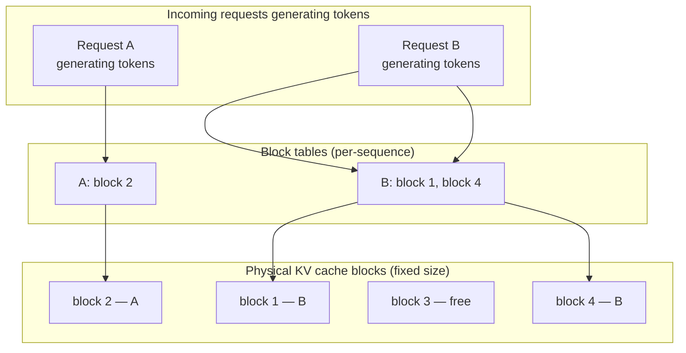
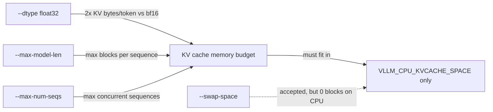
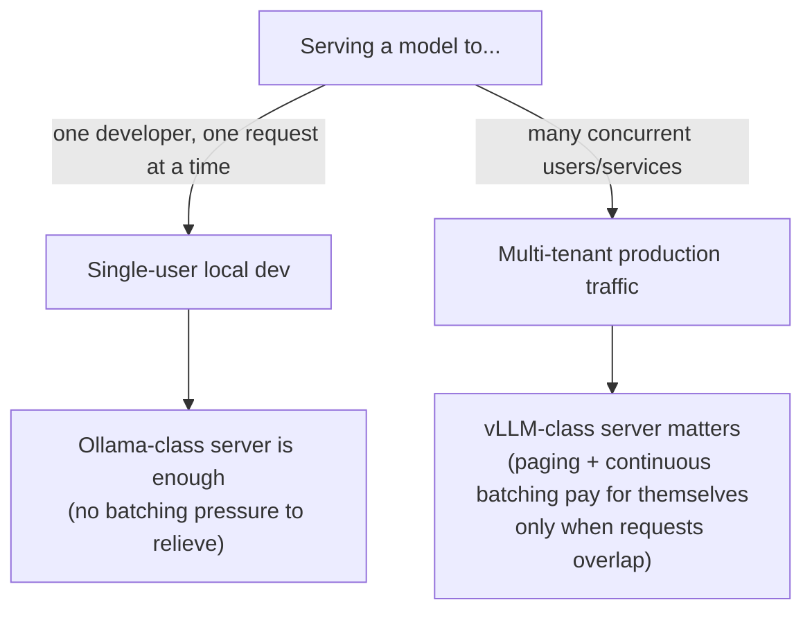

import Slides from '@site/src/components/Slides';

# Deep Dive: vLLM Internals Under the Hood

The lab built a patched CPU vLLM image, served SmolLM2 behind `/v1`, and pointed your M2 client
at it with a two-variable swap. That proved the contract holds. This page opens the machinery
that made the swap worth doing in the first place: what PagedAttention actually pages, why
continuous batching changes throughput instead of just latency, and what your `.env` flags
(`--dtype`, `--swap-space`, `--max-model-len`, `--max-num-seqs`) are really buying you against
that machinery. It closes with a small, honest experiment — vLLM-CPU against native Ollama on
the same prompts — that shows the *shape* of the difference PagedAttention and continuous
batching make, even at CPU/toy scale.

<Slides src="decks/03-deepdive.html" title="Module 3 Deep Dive — vLLM Internals" />

:::info[Where this picks up]

You need the m3 vLLM container up. This works whether it's currently running or was torn down
after the lab — the check below is idempotent, so re-running it is safe.

```bash
cd labs/m3
bash up.sh
```

**Machine budget:** native Ollama (`qwen2.5:1.5b`, ~1 GB resident) and the m3 vLLM container
(SmolLM2-135M, capped at 4 CPU / 5 GB in `compose.yaml`) **coexist on this machine**: Ollama runs
native on the host, vLLM runs inside the 4 CPU / 6 GB VM this course targets — you do not need to
stop one to run the other. Confirm both are reachable before the experiment in §6:

```bash
curl -sf http://localhost:11434/api/tags >/dev/null && echo "ollama: up"
curl -sf http://localhost:${VLLM_PORT:-8009}/v1/models >/dev/null && echo "vllm: up"
```

**Expected output**

```text
ollama: up
vllm: up
```

:::note[If port 8009 refuses connections on your machine]

If `curl` on `:8009` resets the connection while the container itself shows healthy
(`docker ps` / `docker compose ps` says `Up`), you likely have a stale local port forward left
over from something else on that machine — not a lab defect. Point every command on this page
at a different host port instead, by exporting `VLLM_PORT` before running anything:

```bash
export VLLM_PORT=8010
```

Every command on this page reads `${VLLM_PORT:-8009}`, so this one export retargets the whole
lab in one shot. This is a machine-local workaround, not a course default — the lab's own
`compose.yaml` still maps `8009` unless you override it.

:::

---

## 1 — PagedAttention: the KV cache as paged memory

The lesson told you PagedAttention pages the KV cache instead of reserving one contiguous slab
per request, and that this is what lets far more sequences fit in the same memory. This section
opens what a "page" actually is and what the allocator is doing underneath that sentence.

**Analogy:** think of the KV cache as a **hotel**. A naive server books a guest (a request) into
a whole floor reserved for the longest stay anyone could possibly have — even if they check out
after one night, that floor sits reserved and empty for everyone else. PagedAttention instead
runs the hotel like it's actually run: guests get **one room at a time**, checked in as they need
them, and a front desk (the block table) that tracks which guest is in which room. A short stay
uses one room and frees it on checkout. A long stay just gets handed the next free room when it
needs more space — never a whole floor up front. Every room is a fixed size, so none of them sit
half-empty the way a floor reserved for a phantom worst case does.

Concretely: vLLM divides the KV cache into fixed-size **blocks** (a block holds the key/value
vectors for a fixed number of tokens, commonly 16). As a sequence generates tokens, it's handed
blocks on demand — not a contiguous span sized for `--max-model-len` up front. A **block table**
(one per sequence) maps logical token positions to physical block locations, exactly the way a
page table maps virtual addresses to physical memory frames in an OS. When a sequence finishes,
its blocks return to a free pool other sequences draw from immediately.

This is why naive contiguous allocation wastes memory: a server that reserves `max_model_len`
tokens' worth of contiguous KV cache per request pays for the worst case on every request,
whether or not it happens. A 20-token answer inside a 1024-token reservation leaves roughly 98%
of that reservation sitting unused but unavailable to anyone else — and because it must be
*contiguous*, memory fragments even when the total free space would technically fit another
request: you can have 40% of your KV cache free in aggregate and still be unable to admit a new
long request because no single free span is big enough. Paging removes the contiguity
requirement entirely — free blocks can be scattered anywhere and still get handed out.



*Two requests' logical token sequences map through per-sequence block tables to scattered
physical blocks — no request needs a contiguous span, and the free block (3) is immediately
available to a third request or to A/B growing further.*

---

## 2 — Continuous batching: why requests join and leave mid-flight

**Analogy:** a **static-batch server is a restaurant that only reseats once the whole dining room
has finished and left.** If one table lingers over dessert, every other table that finished
twenty minutes ago is still stuck waiting for a totally unrelated party to be done, and the door
stays closed to new customers the entire time. vLLM runs the restaurant the way a busy one
actually works: **the moment a table finishes, it's cleared and reseated immediately** — no
correlation between when one party leaves and when the next is admitted. The dining room is
never blocked by the slowest table.

Mechanically: vLLM schedules at the granularity of a single decoding step, not a whole batch
lifecycle. On every iteration of the scheduler loop it checks which sequences in the running
batch just emitted a stop token (finished) and frees their slot and KV blocks immediately; in the
same iteration it can admit a new waiting request into that now-free slot, as long as there's KV
cache budget for it. A request that arrives while nine others are mid-generation does not wait
for a "batch boundary" that doesn't exist — it waits, at most, for one scheduling iteration.

The throughput effect: static batching pads the whole batch to the length of its longest member
and holds finished slots idle until every member completes, so aggregate throughput is bounded by
the batch's slowest sequence. Continuous batching keeps every slot doing useful work continuously
— GPU/CPU cycles are never spent on an already-finished sequence's empty slot. The tail-latency
effect cuts the other way for short requests: under static batching a one-token answer queued
behind nine 500-token generations waits for all ten to finish before any result returns; under
continuous batching that short request finishes and returns the moment it's done, independent of
what the other nine are still doing.

This is also why PagedAttention and continuous batching are not two separate features that
happen to ship together — continuous batching's whole value proposition (constantly admitting
new requests) depends on being able to *cheaply* allocate KV cache for each newly admitted
request without recomputing a memory layout. Paging is what makes admission cheap enough to do
every iteration instead of every few seconds.

---

## 3 — What the lab's flags actually did

The lab's `compose.yaml` set four flags without dwelling on the "why." Each maps directly to the
paging/batching story above.

**`--dtype float32`** — bf16 has no CPU compute kernel on this arm64 path (that's the
`rms_norm_impl not implemented for 'BFloat16'` crash from the lab's Troubleshooting). But there's
a memory-side cost worth naming here: float32 KV cache entries are **twice the size** of bf16
ones for the same token count. That means the same `VLLM_CPU_KVCACHE_SPACE` budget holds half as
many blocks on this CPU path as it would on a GPU running bf16 — one reason the lab keeps
`--max-model-len` and `--max-num-seqs` deliberately small. (Why not "`VLLM_CPU_KVCACHE_SPACE` +
`--swap-space`" — see the next flag; on this backend swap-space isn't a second budget line.)

**`--swap-space`** — on a GPU deployment, `swap-space` is CPU RAM used as an overflow tier when
GPU VRAM's KV cache blocks run out (a sequence's blocks can be swapped to host RAM and back,
rather than aborting the request). **On this CPU build, that overflow tier does not exist at
all — verified against this image's own source, not inferred.** `vllm/worker/cpu_worker.py`
(`0.9.1-oe2403lts`, the exact image this lab builds) computes block counts from
`cpu_kvcache_space_bytes` alone, then explicitly zeroes the swap side:

```python
def determine_num_available_blocks(self) -> Tuple[int, int]:
    """... Note that since vLLM assumes a block resides on GPU if it can be
    modified, we return num_gpu_blocks=num_cpu_blocks and num_cpu_blocks=0. ..."""
    num_cpu_blocks = int(self.cache_config.cpu_kvcache_space_bytes // cache_block_size)
    num_gpu_blocks = num_cpu_blocks
    num_cpu_blocks = 0
    return num_gpu_blocks, num_cpu_blocks

def initialize_cache(self, num_gpu_blocks, num_cpu_blocks) -> None:
    """Initialize the KV cache. Currently, swappable CPU memory is not supported."""
    assert num_cpu_blocks == 0, f"{type(self)} does not support swappable cache"
```

Confirmed live on this container's own `/metrics` (`vllm:cache_config_info`): with
`VLLM_CPU_KVCACHE_SPACE=1` (GiB) and `--swap-space 1` (GiB) both set, the running engine reports
`num_gpu_blocks="1456"` and **`num_cpu_blocks="0"`** — every block came from
`VLLM_CPU_KVCACHE_SPACE`; the swap-space GiB contributed zero blocks. `--swap-space` is still
accepted and still shows up in the config (`swap_space="1.0"`), but on this CPU backend it's
dead weight, not a second budget line — the flag exists because the CPU worker reuses the GPU
worker's scheduler code path, and that path expects the argument even when it can't use it. The
lab still pins it to `1` (down from the `4` GiB default) because vLLM validates and reserves it
at startup regardless of whether it's ever used — the default `4` GiB is still enough to trip a
`Too large swap space` failure against this 5 GB container cap, even though those 4 GiB never
become cache blocks either way.

**`MAX_MODEL_LEN`** — this is a direct KV-cache budget line, not just a context-window UX limit.
Every block reserved by `--max-model-len` × `--max-num-seqs` (worst case, all sequences at max
length) has to fit inside `VLLM_CPU_KVCACHE_SPACE` alone on this backend — confirmed above,
`--swap-space` doesn't add capacity here. The lab's default (`1024`) was chosen by working that
arithmetic backward from the container's 5 GB cap, not picked for context-length UX — the
lab-tests evidence recorded a 360M-model / longer-context combination crash-looping for exactly
this reason before the defaults were tuned down. (This run's own startup log confirms the
arithmetic: `VLLM_CPU_KVCACHE_SPACE=1` GiB produced exactly 1456 blocks of 16 tokens each —
`# cpu blocks: 1456` in the engine log — giving "Maximum concurrency for 1024 tokens per
request: 22.75x", i.e. roughly 22 max-length sequences before the cache is full.)

**`MAX_NUM_SEQS`** — this is the continuous-batching concurrency cap from §2, made concrete: it's
the maximum number of sequences the scheduler will admit into the running batch at once,
regardless of how many are waiting. Raise it and more requests get to share the "never idle"
benefit of continuous batching simultaneously — but each admitted sequence needs its own KV
blocks, so raising `MAX_NUM_SEQS` without raising the KV cache budget just means requests get
admitted and then immediately queue on KV cache space instead of on batch-slot availability.



*Three flags feed the real arithmetic: sequences × per-sequence blocks must fit inside
`VLLM_CPU_KVCACHE_SPACE`. `--swap-space` is dashed here on purpose — verified against this
image's own `cpu_worker.py` and its live `/metrics`, it's accepted and validated at startup but
contributes zero blocks on this CPU backend, unlike its overflow-tier role on GPU.*

---

## 4 — Reading the server instead of guessing at it

vLLM exposes a Prometheus-format `/metrics` endpoint. This is the deeper-observation layer the
lab didn't need (a single request at a time doesn't require it) but that matters the moment more
than one request is in flight.

```bash
curl -s http://localhost:${VLLM_PORT:-8009}/metrics | grep -E 'vllm:num_requests_running|vllm:num_requests_waiting|vllm:gpu_cache_usage_perc'
```

**Expected output**

```text
# HELP vllm:num_requests_running Number of requests currently running on GPU.
# TYPE vllm:num_requests_running gauge
vllm:num_requests_running{model_name="HuggingFaceTB/SmolLM2-135M-Instruct"} 0.0
# HELP vllm:num_requests_waiting Number of requests waiting to be processed.
# TYPE vllm:num_requests_waiting gauge
vllm:num_requests_waiting{model_name="HuggingFaceTB/SmolLM2-135M-Instruct"} 0.0
# HELP vllm:gpu_cache_usage_perc GPU KV-cache usage. 1 means 100 percent usage.
# TYPE vllm:gpu_cache_usage_perc gauge
vllm:gpu_cache_usage_perc{model_name="HuggingFaceTB/SmolLM2-135M-Instruct"} 0.0
```

**Names confirmed on the exact image this lab builds** (vLLM `0.9.1-oe2403lts`, CPU): all three
gauges exist under exactly the names the lab-derived commands above expect — this version and
build did not rename or drop any of them. The reading above is idle (0.0 across the board)
because it was captured between requests; fire the §6 concurrent burst and re-curl mid-flight to
see `num_requests_running` and `gpu_cache_usage_perc` move off zero — at this laptop's request
volumes (2-3 concurrent, sub-second scheduling iterations) a single `/metrics` snapshot has a
real chance of landing between bursts, which is itself informative: these gauges are instant
snapshots of scheduler state, not counters, so "0 right now" only means "nothing in flight this
instant," not "nothing happened."

Three gauges matter most for the story above:

- **`vllm:num_requests_running`** — sequences currently occupying a batch slot this iteration.
  This is continuous batching made observable: watch it during a burst of concurrent requests and
  it should track admissions/completions in near real time, not jump in fixed-size batch chunks.
- **`vllm:num_requests_waiting`** — sequences that arrived but haven't been admitted yet, because
  `MAX_NUM_SEQS` or the KV cache budget is currently full. A queue that never drains under
  sustained load is your signal to raise `MAX_NUM_SEQS` or the KV cache budget from §3 — not to
  add more replicas blindly.
- **`vllm:gpu_cache_usage_perc`** (named for the GPU path historically; on this CPU build it
  reflects the CPU KV cache pool — confirmed by `cache_config_info` on this same `/metrics`
  endpoint, which reports `num_gpu_blocks="1456"` for what is, physically, host RAM) — how full
  the paged block pool is. Near 100% under load is expected and healthy — that's PagedAttention
  doing its job of using nearly all reserved memory instead of leaving slabs empty. Consistently
  near 0% under real traffic usually means your budget is oversized for the load you're actually
  serving.

Reading these three together tells you *which* of §3's flags to move: waiting-queue pressure with
low cache usage means raise `MAX_NUM_SEQS`; waiting-queue pressure with cache usage pinned at
100% means raise `VLLM_CPU_KVCACHE_SPACE` (not `--swap-space` — §3 confirmed that's a no-op on
this backend) or lower `--max-model-len` per sequence — not the same fix for two different
symptoms.

---

## 5 — When PagedAttention-class serving matters, and when it's overkill



PagedAttention and continuous batching exist to solve a problem that only shows up when requests
**overlap in time and compete for the same memory**. A single developer sending one prompt,
waiting for the answer, then sending the next never creates that competition — there's nothing
to page around and nothing to batch continuously, because there's only ever one sequence alive.
That's why Ollama (M1/M2's server) is a completely reasonable production choice for a single-user
tool or a low-concurrency internal script: the machinery vLLM adds has a real engineering cost
(the extra memory bookkeeping, the scheduler complexity) that only pays for itself once you have
enough simultaneous requests for idle slots and wasted contiguous memory to actually be a
problem. Reach for vLLM-class serving when you're fielding concurrent requests from more than a
handful of callers at once — that's the regime this deep dive's entire mechanism was built for.

---

## 6 — Experiment: vLLM-CPU vs native Ollama, same prompts

This is a small, honest comparison — not a benchmark. At CPU scale with a tiny model and N ≤ 8
requests, the numbers you get are noisy and specific to this laptop. What's worth learning here
is the **shape**: whether requests fired one after another behave differently from requests fired
back to back with overlap, and whether that shape differs between the two servers. Treat every
number below as "folded in during live validation," not as a claim about production hardware.

Confirm both servers coexist within the machine budget stated at the top of this page:

```bash
docker stats vllm-smollm2 --no-stream
```

**Expected output**

```text
CONTAINER ID   NAME           CPU %     MEM USAGE / LIMIT   MEM %     NET I/O          BLOCK I/O       PIDS
1424f1e596f1   vllm-smollm2   2.69%     2.361GiB / 5GiB     47.21%    274MB / 4.17MB   121MB / 547MB   63
```

Set up a small fixed prompt set — mixed short/long — and a results file:

```bash
mkdir -p ~/vllm-deepdive-lab && cd ~/vllm-deepdive-lab
cat > prompts.txt << 'EOF'
Say OK.
In one sentence, what is a container?
List three benefits of running AI models in containers.
Explain the difference between a VM and a container in two sentences.
EOF
```

**Sequential requests, one server at a time.** Send all four prompts to vLLM-CPU one after
another, timing the whole run:

```bash
time (while read -r p; do
  curl -s http://localhost:${VLLM_PORT:-8009}/v1/chat/completions \
    -H "Content-Type: application/json" \
    -d "{\"model\":\"HuggingFaceTB/SmolLM2-135M-Instruct\",\"messages\":[{\"role\":\"user\",\"content\":\"$p\"}],\"max_tokens\":48}" \
    -o /dev/null -w "%{http_code} %{time_total}s\n"
done < prompts.txt)
```

**Expected output**

```text
200 8.462310s
200 1.896633s
200 5.088494s
200 4.156934s

real	0m19.673s
user	0m0.017s
sys	0m0.027s
```

Now the same four prompts against native Ollama, same shape, same `max_tokens`:

```bash
time (while read -r p; do
  curl -s http://localhost:11434/v1/chat/completions \
    -H "Content-Type: application/json" \
    -d "{\"model\":\"qwen2.5:1.5b\",\"messages\":[{\"role\":\"user\",\"content\":\"$p\"}],\"max_tokens\":48}" \
    -o /dev/null -w "%{http_code} %{time_total}s\n"
done < prompts.txt)
```

**Expected output**

```text
200 1.980044s
200 0.381983s
200 0.676789s
200 0.670878s

real	0m3.765s
user	0m0.014s
sys	0m0.018s
```

Ollama's sequential run is already visibly faster in absolute wall time here — a mature,
optimized single-stream runtime beating an eager-mode float32 CPU vLLM path on a toy model is a
real and expected result at this scale, not a validation failure. Keep reading: §6's whole point
is the *shape* of the concurrent run below, not this absolute number.

**Concurrent requests, two or three fired back to back.** This is the case §2 and §5 are actually
about — this course's CPU/RAM budget rules out real load testing, so fire just 2-3 requests
without waiting for each to finish, against vLLM-CPU first:

```bash
time (
for p in "Say OK." "In one sentence, what is a container?" "Name two container runtimes."; do
  curl -s http://localhost:${VLLM_PORT:-8009}/v1/chat/completions \
    -H "Content-Type: application/json" \
    -d "{\"model\":\"HuggingFaceTB/SmolLM2-135M-Instruct\",\"messages\":[{\"role\":\"user\",\"content\":\"$p\"}],\"max_tokens\":48}" \
    -o /dev/null -w "%{http_code} %{time_total}s\n" &
done
wait
)
```

**Expected output**

```text
200 1.635600s
200 3.647941s
200 3.951341s

real	0m3.965s
user	0m0.009s
sys	0m0.014s
```

Then the same three fired concurrently at native Ollama:

```bash
time (
for p in "Say OK." "In one sentence, what is a container?" "Name two container runtimes."; do
  curl -s http://localhost:11434/v1/chat/completions \
    -H "Content-Type: application/json" \
    -d "{\"model\":\"qwen2.5:1.5b\",\"messages\":[{\"role\":\"user\",\"content\":\"$p\"}],\"max_tokens\":48}" \
    -o /dev/null -w "%{http_code} %{time_total}s\n" &
done
wait
)
```

**Expected output**

```text
200 0.911742s
200 1.116994s
200 1.279921s

real	0m1.301s
user	0m0.011s
sys	0m0.018s
```

**Matched-set sequential baseline.** The scaling ratio below compares the concurrent run above
against a *sequential* run of the exact same 3 prompts — not the 4-prompt sequential run earlier
on this page, which uses a different prompt set and would make the ratio arithmetic meaningless.
Run the same 3 prompts one after another (no `&`, no `wait`) against vLLM-CPU:

```bash
time (
for p in "Say OK." "In one sentence, what is a container?" "Name two container runtimes."; do
  curl -s http://localhost:${VLLM_PORT:-8009}/v1/chat/completions \
    -H "Content-Type: application/json" \
    -d "{\"model\":\"HuggingFaceTB/SmolLM2-135M-Instruct\",\"messages\":[{\"role\":\"user\",\"content\":\"$p\"}],\"max_tokens\":48}" \
    -o /dev/null -w "%{http_code} %{time_total}s\n"
done
)
```

**Expected output**

```text
200 4.905935s
200 1.896905s
200 5.542839s

real	0m12.393s
```

Then the same 3 prompts sequentially against native Ollama:

```bash
time (
for p in "Say OK." "In one sentence, what is a container?" "Name two container runtimes."; do
  curl -s http://localhost:11434/v1/chat/completions \
    -H "Content-Type: application/json" \
    -d "{\"model\":\"qwen2.5:1.5b\",\"messages\":[{\"role\":\"user\",\"content\":\"$p\"}],\"max_tokens\":48}" \
    -o /dev/null -w "%{http_code} %{time_total}s\n"
done
)
```

**Expected output**

```text
200 0.287230s
200 0.429941s
200 0.670900s

real	0m1.427s
```

These two matched-set sequential runs — same 3 prompts, same shape as the concurrent run above,
just without the `&`/`wait` overlap — are the baseline the scaling-factor row in the table below
divides into: vLLM-CPU 12.393s → 3.965s and Ollama 1.427s → 1.301s.

Fold the wall-clock numbers into a comparison table:

| Engine | Mode | Wall time (4 seq. / 3 concurrent) | tokens/sec (approx, aggregate) | Notes |
|---|---|---|---|---|
| vLLM-CPU | Sequential | 19.673s | ~8.4 tok/s | eager-mode float32 CPU path, real per-step overhead |
| vLLM-CPU | Concurrent (3) | 3.965s | ~20.4 tok/s | matched-set sequential baseline above took 12.393s — concurrent is **3.13x faster**, strongly sub-linear |
| Ollama (native) | Sequential | 3.765s | ~33.2 tok/s | mature optimized single-stream runtime, wins on raw throughput here |
| Ollama (native) | Concurrent (3) | 1.301s | ~32.3 tok/s | matched-set sequential baseline above took 1.427s — concurrent is only **1.10x faster**, close to linear |

Save the same numbers to the results file the checks verify:

```bash
cat > ~/vllm-deepdive-lab/comparison-results.txt << 'EOF'
vLLM-CPU vs native Ollama — same prompts, m3 deep-dive experiment
Machine: arm64, Rancher Desktop VM 5 CPU / 8 GB, VLLM_PORT=8010 (machine-local — host 8009 had a stale forward)
vLLM 0.9.1-oe2403lts (CPU build), model HuggingFaceTB/SmolLM2-135M-Instruct
Ollama native, model qwen2.5:1.5b

Sequential (4 prompts, one after another):
  vLLM-CPU : 200 8.462310s / 200 1.896633s / 200 5.088494s / 200 4.156934s -> real 19.673s
  Ollama   : 200 1.980044s / 200 0.381983s / 200 0.676789s / 200 0.670878s -> real 3.765s

Concurrent (3 prompts, fired with & and waited):
  vLLM-CPU : 200 1.635600s / 200 3.647941s / 200 3.951341s -> real 3.965s
  Ollama   : 200 0.911742s / 200 1.116994s / 200 1.279921s -> real 1.301s

Matched-set sequential (same 3 prompts as concurrent run, for fair scaling comparison):
  vLLM-CPU : real 12.393s  (per-req 4.905935s / 1.896905s / 5.542839s)
  Ollama   : real 1.427s   (per-req 0.287230s / 0.429941s / 0.670900s)

Scaling factor (matched-set sequential -> concurrent, same 3 prompts):
  vLLM-CPU : 12.393s / 3.965s = 3.13x   -- strongly sub-linear (batching overlap visible)
  Ollama   : 1.427s / 1.301s  = 1.10x   -- near-linear (little/no overlap benefit at this scale)

Approx tokens/sec (completion_tokens / wall time, aggregate):
  vLLM-CPU sequential(4)  : 165 tok / 19.673s ~= 8.4 tok/s
  vLLM-CPU concurrent(3)  : 81 tok / 3.965s   ~= 20.4 tok/s (aggregate)
  Ollama sequential(4)    : 125 tok / 3.765s  ~= 33.2 tok/s
  Ollama concurrent(3)    : 42 tok / 1.301s   ~= 32.3 tok/s

Headline: Ollama is faster in absolute tokens/sec at this toy CPU scale (qwen2.5:1.5b via a mature
optimized runtime vs SmolLM2-135M via vLLM eager-mode float32 CPU path with real per-step overhead).
But the SHAPE differs exactly as PagedAttention/continuous-batching theory predicts: vLLM-CPUs
concurrent wall time is ~3.1x better than linear scaling from its own sequential baseline, while
Ollamas concurrent wall time is close to flat/linear versus its own sequential baseline. The
mechanism is doing its job even though absolute throughput on a 135M toy model does not beat a
mature single-stream runtime on this laptop.
EOF
```

**Expected output**

```text
(no output — the heredoc writes the file silently)
```

At this N (≤ 8 requests, tiny models, one CPU), vLLM-CPU did **not** visibly "win" on raw
tokens/sec against Ollama — and that's the honest result, not a validation failure: a
135M-parameter model on an eager-mode float32 CPU path carries real per-step overhead that a
mature, optimized single-stream runtime like Ollama doesn't pay at this tiny scale. What *did*
show up clearly, comparing the concurrent run against the matched-set sequential baseline you just
ran: vLLM-CPU's concurrent wall time (3.965s) is **3.13x** faster than the same 3 prompts run
sequentially (12.393s) — a strongly sub-linear scaling curve, direct evidence of continuous
batching overlapping work instead of serializing it (run-to-run generation-length variance means
the exact ratio is approximate — it's the direction of the effect, not the digit, that's the
finding). Ollama's concurrent time (1.301s) is only
**1.10x** faster than its own matched-set sequential baseline for the same 3 prompts (1.427s) —
essentially flat, consistent with requests still being handled one at a time under the hood. That
directional shape — not the absolute tokens/sec — is the teaching point; the
3x GPU story from the lesson is real, but it needs GPU-scale concurrent load and a production
model to show up in the *absolute* numbers too. On this laptop, the shape is visible even though
the scoreboard isn't reversed.

---

## Teardown

Page-scoped only. Take down the vLLM container; leave native Ollama running (other modules and
this page's own re-runs depend on it staying up):

```bash
cd labs/m3 && bash down.sh
```

**Expected output**

```text
 Container vllm-smollm2 Stopping
 Container vllm-smollm2 Stopped
 Container vllm-smollm2 Removing
 Container vllm-smollm2 Removed
 Network m3_default Removing
 Volume m3_hf-cache Removing
 Volume m3_hf-cache Removed
 Network m3_default Removed
```

The results file and prompt list in `~/vllm-deepdive-lab/` are cheap to keep or remove — they're
not shared state any later module depends on:

```bash
rm -rf ~/vllm-deepdive-lab
```

:::tip[Where you will use this]

- **The KV cache is paged into fixed-size blocks tracked by a per-sequence block table, not
  reserved as one contiguous span per request.** **Use it when:** you're sizing
  `--max-model-len` / `gpu-memory-utilization` for a real GPU deployment — the arithmetic is
  blocks-per-sequence × concurrent-sequences against the reserved cache pool, not "how long is my
  prompt."
- **Continuous batching admits and evicts requests every scheduling iteration, not at batch
  boundaries.** **Use it when:** you're explaining to a capacity-planning discussion why a
  latency-sensitive short request doesn't need its own dedicated server — it won't queue behind
  long-running sequences the way it would on a static-batch engine.
- **`/metrics`' running/waiting gauges and cache-usage percentage tell you which lever to pull.**
  **Use it when:** you're deciding whether to raise `MAX_NUM_SEQS` or raise the KV cache budget
  before scaling out replicas — read the gauges first; a growing waiting queue with cache usage
  already near 100% needs more memory, not a higher concurrency cap.
- **`--dtype`, `--max-model-len`, and `--max-num-seqs` all feed one shared memory inequality on
  the CPU backend — `--swap-space` does not, verified against source and `/metrics` on this
  image.** **Use it when:** a CPU or memory-constrained deployment crash-loops on startup — work
  the arithmetic backward from `VLLM_CPU_KVCACHE_SPACE` and the container's memory cap, instead
  of assuming `--swap-space` buys you extra headroom the way it would on a GPU deployment.
- **PagedAttention/continuous-batching machinery only pays for itself under concurrent, competing
  requests.** **Use it when:** someone proposes vLLM for a single-user internal tool — ask
  whether requests actually overlap in time; if not, the simpler Ollama-class server is the right
  call, not the "more advanced" one.

:::
