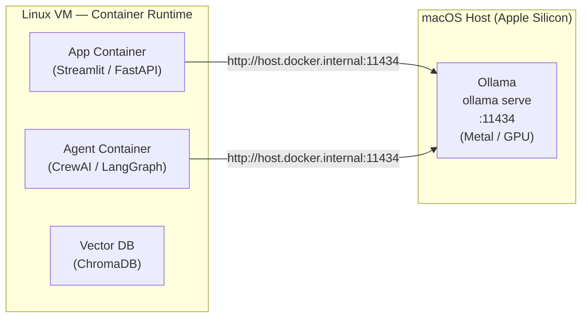

# The GPU Reality on Apple Silicon

**Read this before your first lab.** It explains the single most important constraint of the course and the universal pattern every module is built around.

---

## The Analogy: a Kitchen with a Gas Stove You Can't Move

Imagine you rent a kitchen and want to cook with its gas stove. You can put your pots, pans, ingredients, and serving dishes anywhere — on the counter, in the fridge, on any shelf. But the gas line is **fixed to the wall**. You cannot pick up the stove and put it inside a cupboard. Your prep work lives wherever is convenient; the heat source stays where the gas is.

On Apple Silicon, your GPU is the gas stove. macOS connects the CPU and GPU through **unified memory** and the **Metal framework** — but it does **not** expose that GPU to virtual machines. When a container runtime (Rancher Desktop, OrbStack, Colima, Podman) starts a Linux VM to run your containers, macOS's **Hypervisor.framework** gives that VM CPUs and RAM. It gives it no GPU.

So: a model server running *inside* a container on Apple Silicon falls back to CPU. That is 3–6× slower — not a configuration problem you can fix, but a hard platform boundary.

The solution is the same as the kitchen: **run the heat source natively, put everything else wherever is convenient.**

---

## The Universal Pattern

```
┌─ macOS host ─────────────────────────────────────────────────────┐
│                                                                   │
│  ollama serve          ← uses Metal + unified memory (GPU speed) │
│  listening on :11434                                              │
│                                                                   │
│  ┌─ Linux VM (Rancher Desktop / OrbStack / Colima) ────────────┐ │
│  │                                                              │ │
│  │  app container      → http://host.docker.internal:11434     │ │
│  │  vector DB container                                         │ │
│  │  agent container                                             │ │
│  │  MCP gateway container                                       │ │
│  │                                                              │ │
│  └──────────────────────────────────────────────────────────────┘ │
└───────────────────────────────────────────────────────────────────┘
```

Here it is as a Mermaid diagram for the wiring:



`host.docker.internal` is the magic hostname the container runtime wires to the macOS host. It works on Rancher Desktop, OrbStack, Colima, and Docker Desktop — the Compose Spec `extra_hosts` entry makes it explicit when needed.

---

## Why This Is Actually Good Design

This pattern is not a workaround — it's how production ML systems are often structured:

- The **model server is a shared service**. Multiple apps, agents, and crew members all call the same endpoint. This saves memory and keeps the model warm.
- **Application containers are stateless and cheap**. They start and stop in seconds. Swap the app without touching the model.
- **The API is a wall socket**. Change the model or the runtime behind the endpoint and the application code never notices — it's still just `POST /v1/chat/completions`.

Every lab in this course is built around this separation. You will internalize it by the end of Module 1.

---

## Windows + WSL2 + NVIDIA: When Containers Can Serve the Model

If you are on Windows with an NVIDIA GPU, the story is different: the **NVIDIA Container Toolkit** exposes the GPU to the container runtime via WSL2. A model server running *inside* a container gets full GPU acceleration.

In that case you can run Ollama or vLLM entirely containerized:

```yaml
# compose.yaml excerpt (Windows + NVIDIA only)
services:
  ollama:
    image: ollama/ollama
    deploy:
      resources:
        reservations:
          devices:
            - driver: nvidia
              count: all
              capabilities: [gpu]
```

Mac learners and Windows learners without NVIDIA still hit the same `http://host.docker.internal:11434` endpoint — the only difference is what is behind it. Your app and agent code is identical either way.

---

## Learning vLLM Without a GPU

Module 3 uses vLLM to teach production serving: batching, quantization, and the OpenAI server interface. To make this accessible on any machine, we use vLLM's **prebuilt CPU images**:

```bash
docker run --rm vllm/vllm-openai-cpu:latest-arm64 --help
```

CPU vLLM is slow (expect 2–5 tokens/second on a 1B model), but it is architecturally identical to the GPU version. You learn the API, observe batching behavior, and understand quantization mechanics — then the GPU benchmark shows the throughput difference. Nothing changes in your application code when the backend gets faster.

---

## The One Environment Variable You Need

If Ollama was started without this, containers cannot reach it:

```bash
OLLAMA_HOST=0.0.0.0 ollama serve
```

This tells Ollama to listen on all interfaces, not just `127.0.0.1`. Add it to your shell profile so it survives restarts. See [Prerequisites → Troubleshooting](./prerequisites) for the full fix.

---

You are now ready to start Module 1. The GPU reality will be demonstrated live in the first lab — running a model natively and calling it from a container — so this will click immediately when you see it working.
